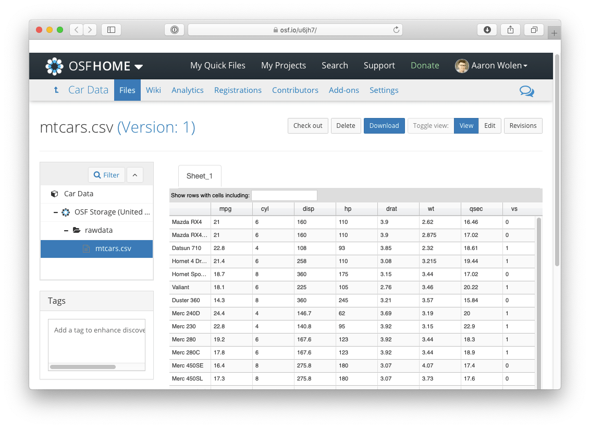

<!-- README.md is generated from README.Rmd. Please edit that file -->

# osfr <a href="https://github.com/aaronwolen/osfr"></a>

[](https://travis-ci.org/aaronwolen/osfr)
[](https://codecov.io/github/aaronwolen/osfr?branch=master)

## Overview

osfr provides a suite of functions for interacting with
[OSF](https://osf.io "Open Science Framework") that are primarily
focused on project management workflows.

OSF (<https://osf.io>) is a free and [open
source](https://github.com/CenterForOpenScience/osf.io "OSF's GitHub Repository")
project management repository designed to support researchers of all
technical backgrounds. The service includes unlimited cloud storage and
file version history, providing a centralized location for all your
research materials that can be kept private, shared with select
collaborators, or made publicly available with citable DOIs.

## Installation

This package is currently under development and is apt to undergo
significant changes until a stable version has been submitted to CRAN.
You’ve been warned.

Also note this version of osfr has been temporarily renamed to *osfr2*.

``` r
# install.packages("devtools")
devtools::install_github("aaronwolen/osfr")
```

## Getting started

There are 3 main types of OSF entities that osfr can work with:

1.  **nodes:** both
    [projects](http://help.osf.io/m/projects/l/481539-create-a-project "OSF: Create a Project")
    and
    [components](http://help.osf.io/m/projects/l/481998-create-components "OSF: Create a Component")
    (i.e., sub-projects) are referred to as nodes
2.  **files:** this includes both files *and* folders stored on OSF
3.  **users:** individuals with OSF accounts

osfr represents these entities within `osf_tbl`s—specialized tibbles
that provide useful information about the entities like their `name` and
unique `id` for users, and API data in the `meta` column that’s
necessary for osfr’s internal functions. Otherwise, they’re just
`data.frames` and can be manipulated using standard functions from base
R or dplyr.

## Usage examples

### Accessing Open Research Materials

Many researchers use OSF to archive and share their work. If you come
across a paper that cites an OSF repository, osfr can be used to explore
the project and download the associated files—you only need the
project’s URL or GUID (global unique identifier) to get started. In
this case, we’re retrieving the Cancer Reproducibility Project
(<https://osf.io/e81xl/>):

``` r
library(osfr2)

cr_project <- osf_retrieve_node("e81xl")
cr_project
#> # A tibble: 1 x 3
#>   name                                    id    meta      
#>   <chr>                                   <chr> <list>    
#> 1 Reproducibility Project: Cancer Biology e81xl <list [3]>
```

This returns an `osf_tbl_node` object with 1 row for the OSF project we
retrieved. Let’s list the files that have been uploaded to this project:

``` r
cr_files <- osf_ls_files(cr_project)
cr_files
#> # A tibble: 4 x 3
#>   name                                     id                     meta     
#>   <chr>                                    <chr>                  <list>   
#> 1 Adjustment of 50 studies to 37 studies.… 565602398c5e4a3877d72… <list [3…
#> 2 papers_and_keywords.xlsx                 553e671b8c5e4a219919e… <list [3…
#> 3 Full_dataset_of_papers_formatted.xls     553e671b8c5e4a219919e… <list [3…
#> 4 METHOD_to_select_papers.txt              553e671b8c5e4a219919e… <list [3…
```

This returns an `osf_tbl_file` with 1 row for each of the files stored
in osf-storage. OSF allows for other resources, like GitHub repos and
dropbox folders, to be connected to projects, but currently the osfr
package only indexes files stored locally in osf-storage. We can examine
any of these files directly on OSF with `osf_open()`, which opens the
corresponding file’s view in your default browser.

We can also list the components nested within the top-level of this
project:

``` r
cr_comps <- osf_ls_nodes(cr_project)
cr_comps
#> # A tibble: 2 x 3
#>   name                                      id    meta      
#>   <chr>                                     <chr> <list>    
#> 1 Replication Studies                       p7ayb <list [3]>
#> 2 Data collection and publishing guidelines a5imq <list [3]>
```

We could continue this pattern of exploration and list the files
contained within *these* projects. You can also download local copies of
files using `osf_download()`.

### Creating projects

*Note: You must authenticate osfr to interact with OSF on your behalf.
See `?osf_auth` for more information.*

Creating a *project* is the first step towards managing your research
with OSF. You can add folders, files, even sub-projects (called
*components*) to a project, and organize them in whatever fashion best
suits your workflow. Many of these initial setup operations can be
performed directly with osfr.

``` r
my_project <- osf_create_project(title = "Motor Trend Car Road Tests")
my_project
#> # A tibble: 1 x 3
#>   name                       id    meta      
#>   <chr>                      <chr> <list>    
#> 1 Motor Trend Car Road Tests r2tzf <list [3]>
```

Using a combination of `osf_create_component()`, `osf_mkdir()`, and
`osf_upload()`, you can easily implement your preferred organizational
structure for a project and populate it with files. Note that osfr’s
functions are [pipe-friendly](https://magrittr.tidyverse.org), meaning
they can be arranged together in pipelines:

``` r
library(magrittr)
# create a local copy of mtcars
write.csv(mtcars, "mtcars.csv")

# upload to the rawdata folder in the "Car Data" project component
my_project %>%
  osf_create_component("Car Data") %>%
  osf_mkdir("rawdata") %>%
  osf_upload("mtcars.csv") %>%
  osf_open()
```



## Acknowledgments

OSF is developed by the [Center for Open
Science](https://cos.io "Center for Open Science") in Charlottesville,
VA.

The original version of osfr was developed by @chartgerink and further
developed by @bgrich. The current version was developed by @aaronwolen
and is *heavily* inspired by @jennybc and @lucymcgowan’s excellent
[googledrive](https://googledrive.tidyverse.org) package. Seriously, we
borrowed a lot of great ideas from them. Other important resources
include [http testing](https://ropensci.github.io/http-testing-book/) by
Scott Chamberlain and [R Packages](http://r-pkgs.had.co.nz) by Hadley
Wickham. Development was also greatly facilitated by OSF’s excellent
[API documentation](https://developer.osf.io "OSF API Documentation").

<!-- links -->
